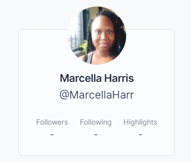

## Daily-*ish* Overview

- **Project**: #100DaysOfOSS Challenge,Week One - Task Four: Getting Started
- **Description**: Getting an understanding about open source and what it means to be a contributor.
- **Tasks completed**: 
    - Read 
    - Created and connected OpenSauced to GitHub.
- **Challenges faced**: Searching for projects on OpenSauced
- **Resources used**: [#100DaysOfOSS community discussion](https://github.com/orgs/open-sauced/discussions) board
- **OpenSauced Highlight**: How to Contribute to Open Sourced Section
 
 

# 100DaysOfOSS Progress Tracker

## Day 1

- **Project**: 100 Days Of OpenSource Challenge, Week One
- **Description**: Set up the project and added content to my progress tracker.
- **Tasks completed**: 
  - Watched the GitHub Education and OpenSauced video on Twitch.
  - Visited OpenSauced GitHub Page to clone and customize the 100DaysOfOSS template.
  - Completed Task I and Task II
- **Challenges faced**: I didn't meet anyone, but I gave thumbs up to a couple of threads. I also started started late (~3weeks) into the challenge. *But*, Pj and Bekah mentioned to not worry about joining late.
- **Resources used**: 
  - [GitHub Education and OpenSauced: 100 days of OSS twitch](https://www.twitch.tv/videos/2218350705)
  - [Discussion Board](https://github.com/orgs/open-sauced/discussions/36)
- **OpenSauced Highlight**: **-**
 

## Day 2

- **Project**: Task Four: Getting Started, *Intro to Open Source*.
- **Description**: I read up to the *"What Happens Next?"* section and just followed the different prompts and guides.
- **Tasks completed**:
  - Created my OpenSauced account
  - Viewed examples of these files:
    - README markdown
    - Contribution Guidelines
    - Code of Conduct
    - Pull Request Form
  - Replied to Week 1's thread on my progress
  - Completed Task IV
- **Challenges faced**: I found it hard to find a project I wanted to join, but I'll have to browse further.
- **Resources used**: 
  - [Intro to Open Source](https://opensauced.pizza/learn/intro-to-oss/) course
- **OpenSauced Highlight**:
<figure style="text-align: center; color: teal;">
  

    
  

  <figcaption>
    
Screenshot of my newly created OpenSauced profile

  </figcaption>
</figure>
