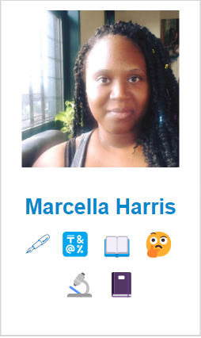

## Daily-*ish* Overview

- **Project**: Open Source Projects Part II
- **Description**: I took a look at the four projects and compared them to see which ones were organized.
- **Tasks completed**: 
    - Week 2, Task Two: How Open Source Projects Are Organized?
    - [Day 10](marcellaharr-oss-journal.md#day-10)
- **Challenges faced**:
- **Resources used**: [OpenSauced Workspace](https://app.opensauced.pizza/workspaces)
- **OpenSauced Highlight**: -
<figure style="text-align: center; color: teal;">
  

    
  

  <figcaption>
    

  </figcaption>
</figure>
 
 

# `100DaysOfOSS` Progress Tracker

#

 

## Day 1

- **Project**: 100 Days Of OpenSource Challenge, Week One
- **Description**: Set up the project and added content to my progress tracker.
- **Tasks completed**: 
  - Watched the GitHub Education and OpenSauced video on Twitch.
  - Visited OpenSauced GitHub Page to clone and customize the 100DaysOfOSS template.
  - Completed Task I and Task II
- **Challenges faced**: I didn't meet anyone, but I gave thumbs up to a couple of threads. I also started started late (~3weeks) into the challenge. *But*, Pj and Bekah mentioned to not worry about joining late.
- **Resources used**: 
  - [GitHub Education and OpenSauced: 100 days of OSS twitch](https://www.twitch.tv/videos/2218350705)
  - [Discussion Board](https://github.com/orgs/open-sauced/discussions/36)
- **OpenSauced Highlight**: **-**
 

## Day 2

- **Project**: Task Four: Getting Started, *Intro to Open Source*.
- **Description**: I read up to the *"What Happens Next?"* section and just followed the different prompts and guides.
- **Tasks completed**:
  - Created my OpenSauced account
  - Viewed examples of these files:
    - README markdown
    - Contribution Guidelines
    - Code of Conduct
    - Pull Request Form
  - Replied to Week 1's thread on my progress
  - Completed Task IV
- **Challenges faced**: I found it hard to find a project I wanted to join, but I'll have to browse further.
- **Resources used**: 
  - [Intro to Open Source](https://opensauced.pizza/learn/intro-to-oss/) course
- **OpenSauced Highlight**:
<figure style="text-align: center; color: teal;">
  

    
  

  <figcaption>
    
Screenshot of my newly created OpenSauced profile

  </figcaption>
</figure>
 
 

## Day 3

- **Project**: OpenSauced Guestbook Repository
- **Description**: Contributing to an open source project.
- **Tasks completed**: 
  - Created an `Issue`
  - Completed the form for the "Issue"
  - Forked and cloned the `guestbook` repo
  - Installed `npm` dependencies
  - Created and described a `new branch`
  - `Added` self and `generated` to the guestbook
  - `Screenshot` of my generated profile
  - Made a log and forked the repo
  - Waited for `Approval`
  - Posted my OpenSauced highlight
  - Joined OpenSauced Discord
- **Challenges faced**: When I submitted the pull request `(PR)`, I wasn’t sure which keyword to use for the `‘Related Tickets & Documents.’` So, I opted for the same one that was in the title `(‘feat #…’)`. Additionally, I had difficulty locating the issue number, so I retrieved it from the screenshot I took when it was initially created. I'll do some research on how to access this information, in the case, I don't take a screenshot. 😊
- **Resources used**: 
  - ["How to Contribute to Open Source" Chapter](https://opensauced.pizza/learn/intro-to-oss/how-to-contribute-to-open-source)
- **OpenSauced Highlight**:
<figure style="text-align: center; color: teal;">
  

    
  

  <figcaption>
    
Guestbook Issue Ticket

  </figcaption>
</figure>
 

<figure style="text-align: center; color: teal;">
  

    
  

  <figcaption>
    
Generated Guestbook Profile

  </figcaption>
</figure>
 

<figure style="text-align: center; color: teal;">
  

    
  

  <figcaption>
    
PR Approval on GitHub

  </figcaption>
</figure>
 

<figure style="text-align: center; color: teal;">
  

    
  

  <figcaption>
    
OpenSauced Guestbook Day-3 Highlight

  </figcaption>
</figure>
 

## Day 4

- **Project**: N/A
- **Description**: **-**
- **Tasks completed**: **-**
- **Challenges faced**: I didn't do anything on day 4.
- **Resources used**: **-**
- **OpenSauced Highlight**: **-**
 

## Day 5

- **Project**: N/A
- **Description**: **-**
- **Tasks completed**: **-**
- **Challenges faced**: I didn't do anything on day 5.
- **Resources used**: **-**
- **OpenSauced Highlight**: **-**
 

## Day 6

- **Project**: *Intro to Open Source*
- **Description**: More reading of the course.
- **Tasks completed**: 
  - Read chapter, "The Secret Sauce"
  - Read Chapter, "Types of Contributions"
- **Challenges faced**: I really struggled to make a post today but I had to since I already missed two days. SMH!
- **Resources used**: 
  - ["Intro to Open Source](https://opensauced.pizza/learn/intro-to-oss/how-to-contribute-to-open-source)
- **OpenSauced Highlight**: **-**
 

## Day 7

- **Project**: *Intro to Open Source*
- **Description**: I finished the course and did the first two steps of the `"What's Next"` section.
- **Tasks completed**: 
  - Read chapter, "What's Next"
  - Added two repositories to my OpenSauced workspace.
- **Challenges faced**: I want to join at least one repo that is based on genealogy. Unfortunately, a couple of the ones available on OpenSauced were inactive and a bit intimidating. However, I did find two repositories that are for first-time contributors, even though they are outside of my interests, I believe they'll help me build on my experience in open source and my confidence in contributing.
- **Resources used**: 
  - ["Intro to Open Source](https://opensauced.pizza/learn/intro-to-oss/how-to-contribute-to-open-source)
  - OpenSauced.Pizza
- **OpenSauced Highlight**:
<figure style="text-align: center; color: teal;">
  

    
  

  <figcaption>
    
Screenshot of my Workspace

  </figcaption>
</figure>
 
 

## Day 8

- **Project**: Week 2: Share your OSCR Card
- **Description**: My DevCard's value is 1 because of the initial contribution I made during week one.
- **Tasks completed**: 
  - Accessed my OpenSauced profile
  - Clicked on the DevCard icon by my profile pic
  - Copied and shared my DevCard
- **Challenges faced**: -
- **Resources used**: 
  - OpenSauced.Pizza Profile
- **OpenSauced Highlight**:
<figure style="text-align: center; color: teal;">
  

    
    
  

  <figcaption>
    
Screenshot of my DevCard

  </figcaption>
</figure>
 
 
 

## Day 9

- **Project**: Week 2, Task Two: Find Projects You're Interested in
- **Description**: I browsed all of the beginner open-source projects listed on FreeCodeCamp's "How to Contribute to Open Source" GitHub page. After identifying about 15 suitable projects from the 25 listed for beginners, I used OpenSauced to add them to my 'Workspace' because it's a convenient way to keep track of the projects I'm interested in.
- **Tasks completed**: 
  - Found:
    - [@BeeWare](https://github.com/beeware)
    - [@PublicLab](https://github.com/publiclab)
    - [@nteract](https://github.com/nteract)
    - [@PradumnaSaraf](https://github.com/Pradumnasaraf)
- **Challenges faced**: There wasn't a challenge per se; it just took longer than I thought, but that was because I wanted to focus and select the ones that made me feel comfortable.
- **Resources used**: 
  - [FreeCodeCamp GitHub](https://github.com/freeCodeCamp/how-to-contribute-to-open-source/blob/main/PROJECTS.md)
  - [OpenSauced Explore](https://app.opensauced.pizza/)
- **OpenSauced Highlight**: -
<figure style="text-align: center; color: teal;">
  

    
  

  <figcaption>
    

  </figcaption>
</figure>
 

## Day 10

- **Project**: Week 2, Task Two: How Open Source Projects Are Organized?
- **Description**: I read all the `README.MDs`, `CONTRIBUTING.MDs` (for the ones I was able to find), and I reviewed a couple of the `Feature Requests` and `Bug Reports` for each of the four projects. Overall, the majority of the four are definitely __beginner-friendly__.
- **Tasks completed**: 
  - Found:
    - |[@nteract](https://github.com/nteract)|  Format | Info | Available | Clear & Concise | Active |
      |--------------------------------------|---------|------|-----------|-----------------|--------|
      |README                                |Organized|About repo, Contribution instructions, and How-To |Yes   |Yes | Yes|
      |CONTRIBUTING                          |Organized  |Knowledge requirements and How-TOs |Yes         |Yes |Yes |
      |Feature Requests                      |Template |States a specific matter and was assigned |Yes |Yes |Yes |
      |Bug Reports                           |Template |States a specific bug, recreates the bug, and gives a solution |Yes |Yes |Yes |

    - |[@PradumnaSaraf](https://github.com/Pradumnasaraf/open-source-with-pradumna)| Format | Info | Available | Clear & Concise | Active |
      |------------------------------------------------|--------|------|-----------|-----------------|-----|
      |README                                          |Organized |How-to, Contribution instructions, Resources, and FAQs|Yes |Yes |Yes |
      |CONTRIBUTING |Organized |How-to and Documentations |Yes |Yes |Yes |
      |Feature Requests |Template (closed ones)|States a specific matter and was assigned |Yes (closed ones) |No (~ incomplete) |No |
      |Bug Reports |Template |States the solution to the bug |Yes |No, (~ incomplete) |No |

    - |[@BeeWare Toga](https://github.com/beeware)| Format | Info | Available | Clear & Concise | Active |
      |--------------------------------------|--------|------|-----------|-----------------|-------------|
      |README                                |Organized |About repo, Documentation, Community, and Contribution/How-to |Yes |Yes |Yes |
      |CONTRIBUTING                          |Organized |How-to, Community Incentives, and Code of Conduct  |Yes (external link) |Yes |Yes |
      |Feature Requests                      |Template |States a specific matter and was assigned |Yes |Yes |Yes |
      |Bug Reports                           |Template |States a specific bug, recreates bug, screenshots, ans the solution to the bug |Yes |Yes |Yes |

    - |[@PublicLab plots2](https://github.com/publiclab)| Format | Info | Available | Clear & Concise | Active |
      |------------------------------------------|--------|------|-----------|-----------------|--------|
      |README                                    |Organized |About repo, How-TOs, Contribution instructions, and Code of Conduct |Yes |Yes |Yes |
      |CONTRIBUTING                              |Organized |How-To, Code of Conduct, Community Chatroom |Yes (external link) |Yes |Yes |
      |Feature Requests                          |Freeform |States a specific matter and was assigned |Yes |No (~ incomplete) |Yes |
      |Bug Reports                               |Template |States a specific bug and was resolved |Yes |No (~ incomplete) |Yes |

- **Challenges faced**: -
- **Resources used**:
  - [How to Write a Good Issue Post](https://opensauced.pizza/docs/community-resources/how-to-write-a-good-issue-tips-for-effective-communication-in-open-source/)
  - GitHub Repos
  - [My OpenSauced Workspace](https://app.opensauced.pizza/workspaces)
- **OpenSauced Highlight**: -
<figure style="text-align: center; color: teal;">
  

    
  

  <figcaption>
    

  </figcaption>
</figure>
 

[Back to the top](#daily-ish-overview)
